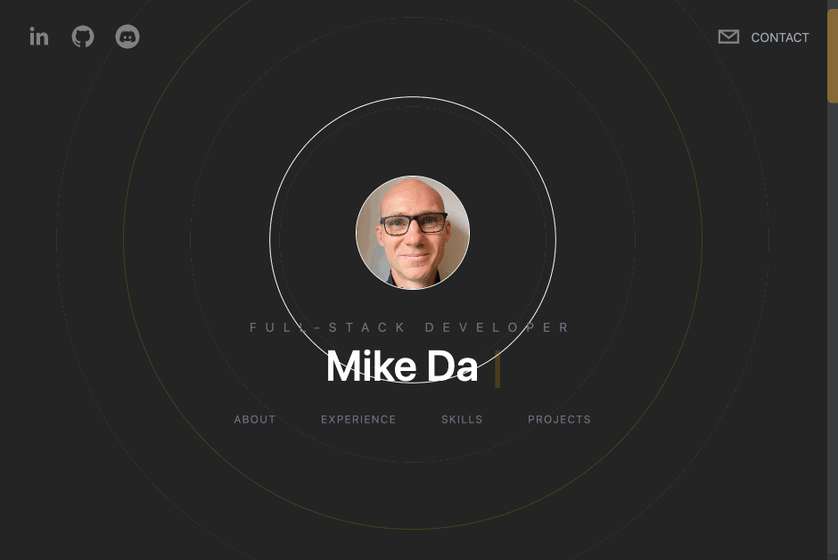

# Personal Portfolio

We all need our own website where we can show off all the amazing projects we're working on, right?!
Either way, this one is mine.



I was amazed that 


## Getting Started

First, run the development server:

```bash
npm run dev
# or
yarn dev
```

Open [http://localhost:3000](http://localhost:3000) with your browser to see the result.

## Tech Stack

[](https://www.typescriptlang.org/)
[](https://whatwg.org/)
[](https://www.w3.org/Style/CSS/Overview.en.html)
[](https://nodejs.org/en)
[](https://nextjs.org/)
[](https://tailwindcss.com/)